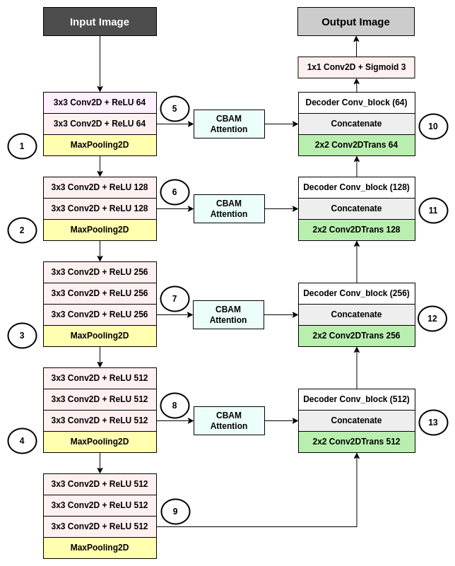

# LLE_UNET Layer Visualization for Underwater Imagery

This repository contains visualizations of the LLE_UNET layers applied to underwater imagery. The images below showcase the transformation of the images as they pass through different layers of the network.

## Model Overview

Explain briefly about the LLE_UNET model and its purpose.

## Layer Visualizations

### Input Image

*Figure 1: Original underwater image.*

### Layer 1 Output

*Figure 2: Output after passing through the first layer of LLE_UNET.*

### Layer 2 Output

*Figure 3: Output after passing through the second layer of LLE_UNET.*

## How to Use

Provide instructions on how to use or integrate the LLE_UNET model or the visualizations in this repository.

## License

Include any licensing information if applicable.

## Acknowledgements

Give credit to any resources, tools, or individuals that contributed to the project.

## Contact

Provide your contact information or ways to reach out for questions, concerns, or collaborations.
